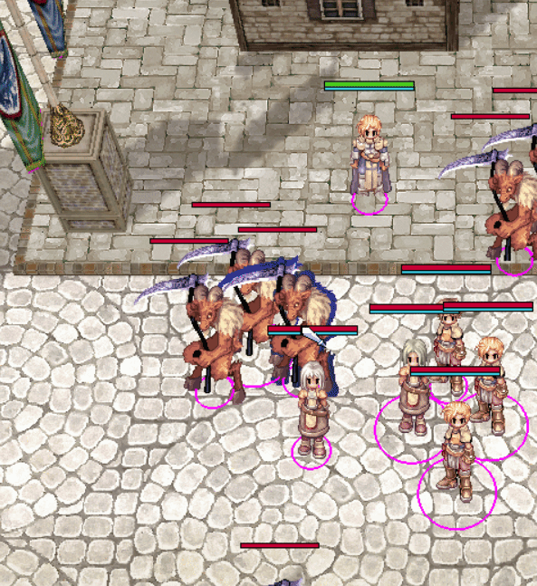
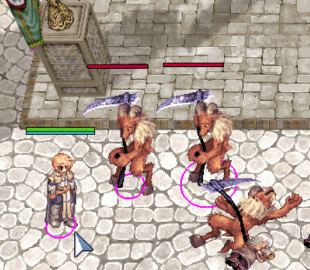
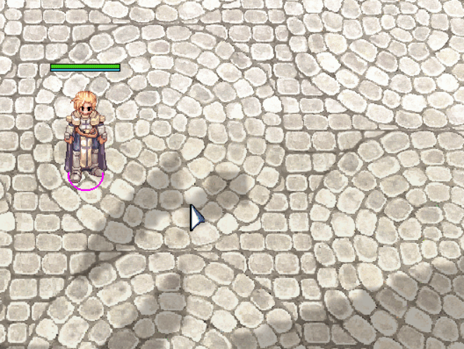

# Table of contents
- [Building](#building)
- [Running on Windows](#running-on-windows)
- [How to play](#how-to-play)
- [Design decisions](#design-decisions)
- [Blog](#blog)
- [Current Status and Gallery](#current-status-and-gallery)
- [Background story](#background-story)
  - [About the used game assets](#about-the-used-game-assets)
- [Thanks](#thanks)

# Rustarok

A project whose primary goals are to have fun developing it and experiment with interesting technical problems from the world of game development.

It is intended to be a multiplayer, fast-paced Moba style game. Check [Background story](#background-story) for details.


## Building

- ``git clone https://github.com/bbodi/rustarok.git``
- ``cargo build``

## Running on Windows
You will need Ragnarok Online asset files to run the game.

- Download a Ragnarok Online client from [some](https://talonro.com/) [popular](http://playdreamerro.com/) [private server](https://topg.org/ragnarok-private-servers/)

- Install it

- Check the installation directory for any ``*.grf`` files, and put their paths into ``config.toml``, e.g.:
  ```
  grf_paths = [
    "d:\\Games\\TalonRO\\rdata.grf",
    "d:\\Games\\TalonRO\\sdata.grf",
    "d:\\Games\\TalonRO\\tdata.grf"
  ]
  ```
  
- Run ``cargo run`` from rustarok directory.

## How to play

- Move your character with the right mouse button
- Cast skills with Q (fire wall), W (lightning), E (heal), R (huge boom) keys
- Spawn entities with the "Players" and "Monsters" sliders in the window
- Move the camera with the cursor keys

## Design decisions
- [Statuses](https://github.com/bbodi/rustarok/issues/1)
- [Rendering system](https://github.com/bbodi/rustarok/issues/4)

## Blog

- [2019W30](https://github.com/bbodi/rustarok/issues/6)

## Current Status and Gallery

Currently the project is in a very early stage. Nothing is set in stone yet, I mostly prototyping ideas and techniques.


List of developed features:

- [x] Asset file loading (grf, gnd, rsm, rsw, spr, act, str)
- [x] Rendering
  - [x] Map (ground, static models, lighting)
- [x] Sprites for UI
  - [x] Sprites in 3D world (animated sprites and effects as well)
    - [x] Different actions (idle, sit, walk, attack, cast etc)
    - [x] Directions
- [x] Amount of damages, heals, etc
  - [x] Health and Mana bar above the characters
- [x] Input handling, Control
  - [x] Moving around with your character
  - [x] Assigning skills to Q, W, E, R, etc keys
  - [x] Continuous movement towards the mouse if RMB is down
- [x] Skills
  - [x] Skill target area/entity selection mode
  - [x] Skill casting
  - [x] Skill manifestations (the manifested outcome of using a skill, e.g. a fire wall in the 3D world which can't be walk through and it damages contacting entities)
  - [x] Quick cast settings (on, on-release, off)
- [x] Battle
  - [x] Attacking an enemy 
  - [x] Attack speed
  - [x] Health, dying
- [x] Collision
  - [x] Static objects
  - [x] Characters, a.k.a [body block](https://www.youtube.com/watch?v=nk2O6YsCWwI)

<p float="left">





</p>

## Background story

I play computer games rarely, but when I do, I play 1 or 2 sessions of Heroes of The Storm match. 

But still, whenever I play, I am constantly thinking about how I would implement some mechanics of the game. 

So finally I reached the point where fantasizing is not enough anymore, and wanted to actually try myself in this area as well. 

Don't be surprised if the game is heavily inspired by HoTS, most probably the playable character styles and skills will be based on my favourite characters from it, or the ones whose skill mechanics I find challenging or interesting.

### About the used game assets

The visuals of Rustarok might be familiar to you. It is because the game uses assets from an existing game, an older popular Korean MMORPG, Ragnarok Online. The reasons I used them:

- I am not a graphic designer, I don't have the skills nor the temptation to create the visuals of a game myself.

- Again, my primary goal is to experiment, learn and have fun while **developing** something challenging.

- I am in love with the unique 2D/3D graphic style of the game.

- Ragnarok Online game asset file structures are known and there are example implementations for processing them.

- Ragnarok Online had a huge impact on me when I was younger. I played a lot with it, this might have been the only game I was obsessed with.

  Thanks to it, I know all the skills, sprites, maps, models etc, which is useful when I try to come up with visualities of some new skill.

- The server code of Ragnarok Online has been exposed for a very long time. That was the first professional C source code I studied, hacked and even fixed when I was around 14-15, so it had a huge impact on me as a software developer.

## Thanks

- [roBrowser](https://github.com/vthibault/roBrowser/): Its source code was useful for decoding the game asset files
