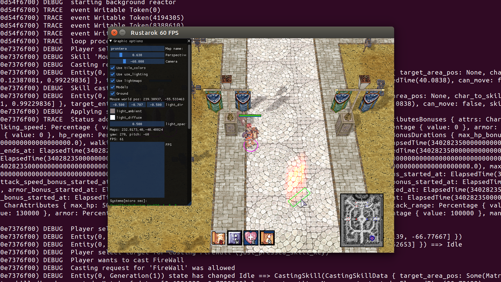

# Running with Containers

If you want to skip ahead to how to pull and run the Docker container with
Singularity, see [the singularity section](#singularity).



## 1. Download Assets

If you want to use Docker, you are likely running on Linux and can't easily obtain
Ragnarok Online asset files (which come from Windows exe. If you *are* on Windows,
you can follow the instructions in the [main README](../README.md) to download 
a Ragnarok Online client and add:

 - rdata.grf
 - sdata.grf
 - tdata.grf
 - gepard.grf

to the [config.toml](../config.toml) file. If you are running on Linux, then you
will need to build a Singularity container with wine to download the client,
and copy the assets. We use Singularity because it has seamless environment and interaction
with the host, so we don't have any issues using the display, Specifically, 
once you've [installed Singularity](https://sylabs.io/guides/3.4/user-guide/installation.html),
from this directory, build the container:

```bash
$ sudo singularity build wine.sif Singularity.wine
```

During the build, it will download and extract the TalonRO client. Then you
can run the container (binding your local .wine folder) to the container to install
Ragnarok there:

```bash
$ singularity run --bind $HOME/.wine:/root/.wine wine.sif
```

If you are interested, the runscript in the container shows you the wine prefix (the
folder bound to your host, so that we have write and can obtain files there) and
then installs the client:

```
%runscript
echo "WINEPREFIX is $WINEPREFIX"
exec wine /TalonRO_Full_Installer.exe "$@"
```

It will open up an interactive GUI and you can click through the steps to install.
I opted for all the defaults, and to install the background music (checking an extra box)
because I wasn't sure if I needed those files. After running the container, you can
see what was extracted to your wine directory:

```bash
$ ls $HOME/.wine/drive_c/Games/TalonRO
AI           dinput.ini      granny2.dll  lua.exe      msvcp110.dll       rdata.grf  Setup.ini     TalonPatch.conf  tdata.grf      txmas.grf
binkw32.dll  gepard.dll      ijl15.dll    Mp3dec.asi   msvcr110.dll       savedata   skin          TalonPatch.exe   thallo.grf     unins000.dat
cps.dll      gepard.grf      Init.exe     Mss32.dll    RagnarokSetup.exe  sdata.grf  System        talo.nro         tmp.conf       unins000.exe
dinput.dll   gepard.license  libcurl.dll  Mssfast.m3d  RagnarokSetup.ini  Setup.exe  talonexe.exe  talonro.dat      tpalettes.grf
```

At this point, you should move the *.grf files that we need to the present working directory (the docker folder):

```bash
for filename in rdata tdata gepard; do
    cp "${HOME}/.wine/drive_c/Games/TalonRO/${filename}.grf .
done
```

## 2. Build / Pull the Docker Base

Since the sdl dependencies can take a while to install, a [base image](https://hub.docker.com/r/vanessa/rustarok-base) is provided. You can either build it locally (from this folder):

```bash
$ docker build -t vanessa/rustarok-base .
```

or you can pull it for use:

```bash
$ docker pull vanessa/rustarok-base
```

It builds from the [Dockerfile](Dockerfile) in this directory.

## 3. Build Docker Container

Next, build the docker container, this time from the root directory:

```bash
$ cd ../
$ docker build -t vanessa/rustarok .
```

By default, we will build the container with `sleep_ms = 0` instead of the default `sleep_ms = 10`.
If you want to change this, provide the value as a build argument:

```bash
$ docker build --build-arg RUSTAROK_SLEEPMS=10 -t vanessa/rustarok .
```

And of course you can change the name of the image to be your Docker username, if you have one.
The [config.toml](docker/config.toml) from the docker directory will be used instead
of the default, which has paths to the *.grf files that we just generated in the docker folder.


## 4. Push to Docker Hub

Since the display will work nicely with a Singularity container, the Docker container
that we've built will best be used via pull with Singularity. If you just built your
own image, you can push to Docker Hub:

```bash
$ docker push vanessa/rustarok
```

## 5. Run the Container

To run the container, Singularity is the best bet, and Docker could work with some fiddling.

### Singularity

For easier (working!) integration, Singularity is probably the way to go. Once you push to Docker Hubm you can pull your container to Singularity, and run it.

```bash
$ singularity pull docker://vanessa/rustarok
```

It's a fairly large container, so pulling the larger layers might take some time.
Once you have the container locally, here is how to run it. Note
that we need to set the present working directory to be code to ensure
that we find the configuration files:

```bash
$ singularity run --pwd /code rustarok_latest.sif
```

After a quick load, you'll have the game open up to play!


If you want to build some container, you can use (and modify) the [Singularity](Singularity) file here:

```bash
$ sudo singularity build rustarok.sif Singularity
```

And (assuming you don't edit any `%runscript`) you can run the container
the same as the above. If you need to shell inside to look around or debug:

```bash
$ singularity shell rustarok.sif
```

### Debugging

If you get an error about the audio device not being ready:

```bash
ALSA lib pcm_dmix.c:1108:(snd_pcm_dmix_open) unable to open slave
thread 'main' panicked at 'called `Result::unwrap()` on an `Err` value: "Audio device hasn\'t been opened"', src/libcore/result.rs:1084:5
note: run with `RUST_BACKTRACE=1` environment variable to display a backtrace.
```

It's a simpler issue than you think - it means some other application is using audio on your computer (e.g., streaming music from online, or a web conferencing system). The fix is to stop streaming audio from this other application to continue.

### Docker

For Docker, it's a bit harder to use the display (but not impossible!). I haven't gotten it to
work, but here is a start if you want to play around:

```bash
docker run -it --rm \
       -e DISPLAY=$DISPLAY \
       --device /dev/video0:/dev/video0 \
       --volume $HOME/.Xauthority:/root/.Xauthority \
       -v /tmp/.X11-unix:/tmp/.X11-unix \
       vanessa/rustarok
```

For me, I get the error message that I don't have a video:

```bash
    Finished dev [unoptimized + debuginfo] target(s) in 0.24s
     Running `target/debug/rustarok`
[00:00:04.302] (7fc0bfb2df40) INFO   GRF loading: 4302ms
No protocol specified
error: XDG_RUNTIME_DIR not set in the environment.
thread 'main' panicked at 'called `Result::unwrap()` on an `Err` value: "No available video device"', src/libcore/result.rs:1084:5
note: run with `RUST_BACKTRACE=1` environment variable to display a backtrace.
```

If you get this to work, please open a pull request to update these docs.
